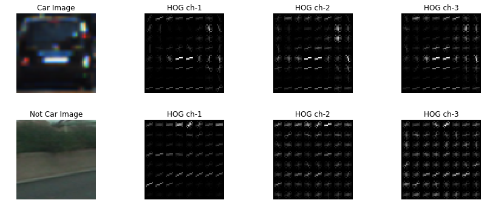
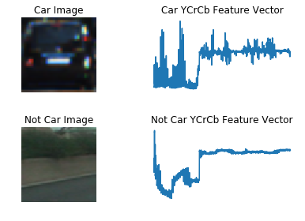
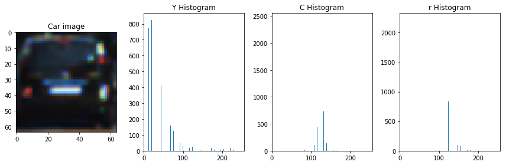
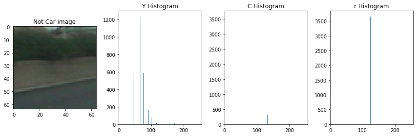
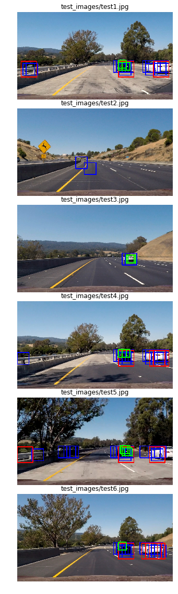
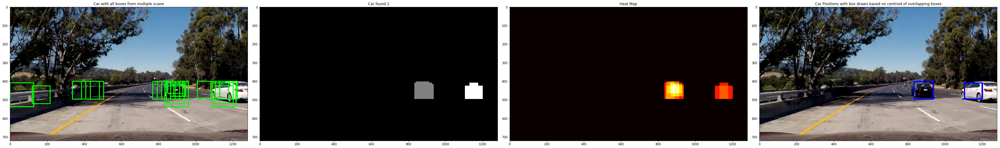

## Vehicle Detection Project

The goals / steps of this project are the following:

Perform a Histogram of Oriented Gradients (HOG) feature extraction on a labeled training set of images and train a classifier Linear SVM classifier
Optionally, can also apply a color transform and append binned color features, as well as histograms of color, to  the HOG feature vector.

For the above 2 steps normalize the features and randomize a selection for training and testing.

Implement a sliding-window technique and use the trained classifier to search for vehicles in images.
Run the pipeline on a video stream (start with the test_video.mp4 and later implement on full project_video.mp4) and create a heat map of recurring detections frame by frame to reject outliers and follow detected vehicles.
Estimate a bounding box for vehicles detected.

### 1. Histogram of Oriented Gradients (HOG)

The computed gradient magnitudes and direction at each pixel has groupd into small cell of size 8(here) and each has 8 pixels. Inside each cell a histogram of gradient directions or orientations from each 64 pixes with in the cell and these samples are distributed within 9(here) orientation bins and sum the samples per bin. Each pixel in the image gets a vote in which histogram bin it belongs to.

From line 36 to 64 I extracted the HOG for a car and non-car image and visualized it from line 67 to 100 bellow.
Please see file CarND-Vehicle-Detection.better.ipynb

### 2. Spatial Binning of Color 

Template matching is not a particularly robust method for finding vehicles unless we know exactly what the target object looks like. However, raw pixel values are still quite useful to include in  feature vector in searching for cars.

While it could be cumbersome to include three color channels of a full resolution image, we can perform spatial binning on an image and still retain enough information to help in finding vehicles.

As can be seen in the example bellow, even going all the way down to 32 x 32 pixel resolution, the car itself is still clearly identifiable by eye, and this means that the relevant features are still preserved at this resolution. The Feature vectors for car and non-car images are illustrated on line 31 to 48 bellow.

Also by visualization I observed binned color features are quite different between car and non-car image when using color 'YCrCb' and is a better selection in this case.  

see file CarND-Vehicle-Detection.better.ipynb for this sesion 

### 3. Histograms of pixel intensity (color histograms) as features 

Image template is useful for detecting things those do not very in their appearance much such as fixed logos etc.
But in real world objects i.e. a running car appears in different forms and orientation. We can compute the histogram of color value with the idea that image location with similar color distribution will reveal a close match. Variance and different image size can also be accomodated by normalizing the histogram. Color histogram are shown bellow for car and non-car images. I used each color channel from color space YCrCb, Although I do not see a lot of difference between car and non-car image in this case.

    Car image vehicles/KITTI_extracted/3529.png color histogram

### 4. Train  a classifier using selected HOG features and other features

I use the color space 'YCrCb' with 12 orientation, 8 pixel per cell and 2 cell per block and use all channel of the color space to extract 3 features i.e HOG, Spatial Binning (resize the image to 32x32) and color histogram  
and use the provided car and non-car images, vertically (rowwise) stack them and use sklean StandardScaler function to standardize features by removing the mean and scaling to unit variance, it is important to do so as large sigma/variance means high opinionated and small variance means more uncertainity and it is hard to train in both cases. Normalizing ensures that classifier's behavior isn't dominated by just a subset of the features, and that the training process is as efficient as possible. Once called the  X_scaler.transform(X), scaled_X has the 
normalized feature vector.
Then I split up data into randomized training and test sets (20% split) in line 37,38 bellow. Testing the classifier on a separate dataset will prevent against overfitting and provide a more realistic estimate of accuracy and error while random shuffling ensures that ordering effects don't influence the classifier.
Also note that the number of feature for car and non car is 8792 and 8968 which is pretty  balance. Preparing a balanced dataset ensures that one class does not dominate the classifier's performance.

I used LUV (the L component has the range [0,100], the U component has the range [-134,220], and the V component has the range [-140,122]) and YUV(Y ranges from 0 to 1 (or 0 to 255 in digital formats), while U and V range from -0.5 to 0.5 (or -128 to 127 in signed digital form, or 0 to 255 in unsigned form)) color space, I noticed when using those above color space I had to set transform_sqrt=False when calling hog() for hog feature extraction as 
it causes an error(NaN) as the image contains negative values (because it's taking the square root of image values.

I tried with Naive base which was faster in training with an accuracy of 0.9516 and 2.57 seconds to train.
I tried with decision tree with default=”gini” for the Gini impurity and with default minimum split, it took long 
long time on my Mac with 2.2 GHz Intel Core i7 and 16 GB of ram. Then I change the minimum split to 50 (stop the tree growth at 50 child nodes) I got around 0.965 test accuracy.

Lastly I came back to color 'YCrCb', with Linear Support Vector Classifier and get a test accuracy of 0.9896 !

    car_features:  8792 notcar_features 8968
    94.7 Seconds to extract HOG features...
    X  17760 scaled_X (17760, 10224) Y (17760,)
    Using: 12 orientations 8 pixels per cell and 2 cells per block
    Feature vector length: 10224
    X_train (14208, 10224)
    8.99 Seconds to train SVC...
    Test Accuracy of SVC =  0.9896
    My SVC predicts:  [ 1.  0.  1.  0.  1.  0.  1.  1.  1.  1.]
    For these 10 labels:  [ 1.  0.  1.  0.  1.  0.  1.  1.  1.  1.]
    0.00136 Seconds to predict 10 labels with SVC
    DONE

### 5.Sliding Window Search

I use the Hog Sub-sampling Window Search that was implemented in this course material which is an efficient one 
that allows to only have to extract the Hog features once. The function find_cars bellow able to both extract features and make predictions.I ran this same function multiple times for different scale values to generate multiple-scaled search windows.

###### Following code implements a sliding window search and the images after it showcases the detection windows.
I use small scale of 1 for frames at far from the car as cars on those frame will be smaller than scale 1.5 for closer frame and even bigger scale of 2 for more closer frame. As see on the picture bellow , Red boxes are closer than Blue boxes than Green boxes from the car.

#### Describe the implementation of filter for false positives and a method for combining overlapping bounding boxes.

I recorded the positions of positive detections in each frame of the video. From the positive detections I created a heatmap and then thresholded (in this case by visually observing the number of false positives) that map to identify vehicle positions. I then used scipy.ndimage.measurements.label() to identify individual blobs in the heatmap. I then assumed each blob corresponded to a vehicle and constructed bounding boxes to cover the area of each blob detected.
Following code snippet implement the functions to generate heatmap, apply the threshold and draw the labeled boxes. These functions are taken directly from the course material.

Here's an example result with an image showing its corresponding  overlapping detections image (1st from left), label image (2nd from left) , heat-maps (3rd from left) and the final image with bounding box and false detection removed (4th from left)

#### Create a Class to store the context over multiple frames

#### Video Implementation
Following is the main pipeline that takes each frame from the video, use 3 sliding window with an scale of 1, 1.5 and 2 on far, closer and more closer frames to detect the car and store the detected boxes for last 10 frames, generate heat-map based on this last 10 detected boxes across multiple sliding windows and apply a threshold of 50% and finally draw the boxes on the image and return it.

#### Discussion

####1. Briefly discuss any problems / issues you faced in your implementation of this project. Where will your pipeline likely fail? What could you do to make it more robust?

There are some false positive (which I do not consider to be false) as those cars are comming from the other direction (on the left) and I could have used the xstart to regulate the starting of the sliding windows in X direction to filterout those detection or detect the lane line as in previous project and ignore any detection outside of the lane line but that will not be practicle as I think this is important to detect anything along the x axis even if they are outside of the lane. 

I could have use more sliding windows to make the bounded box more stable and wanted to make it simple and faster for now.

I could have calculate the centroid of each detected boxes per frame, measure the distance of these centroids among the boxes near the same location (with some += mergin) over few frames and can estimate the projected distance of the same box(car) on the next upcomming frame and draw it and could make the pipeline faster as was suggested in the course video. But that should also take into consideration the fact that car passing my car can slow down and in next frame it may appear closer as oppose to farther.

I coud have shown the number of car detected (labels[1]) based on heatmap & before and after applying threshold on realtime to make the video more predictable about the pipeline, also could have implemented a dynamic sliding window where  more scanning will be done when there is a change in the number of detection and apply even a harder thresold in this transient time to ignore the false positive etc.

